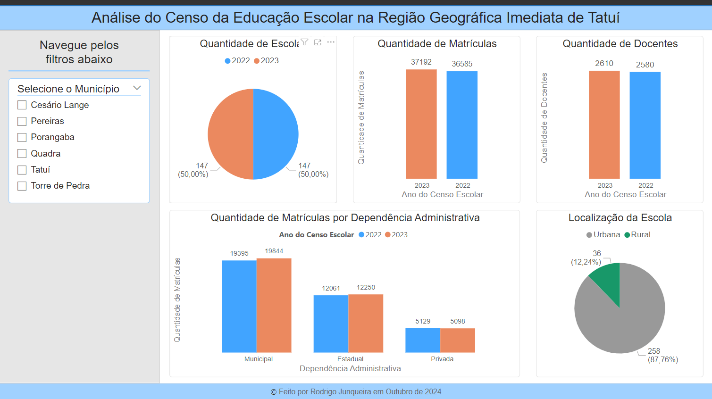
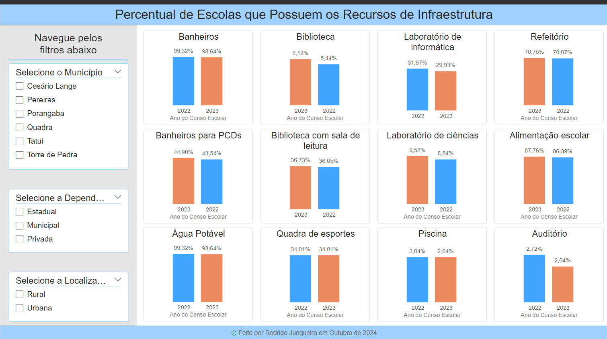
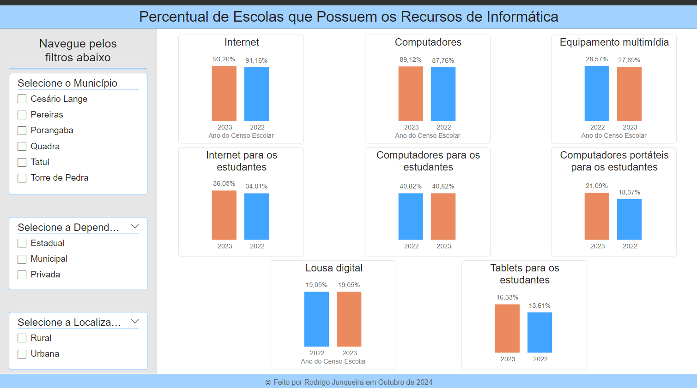
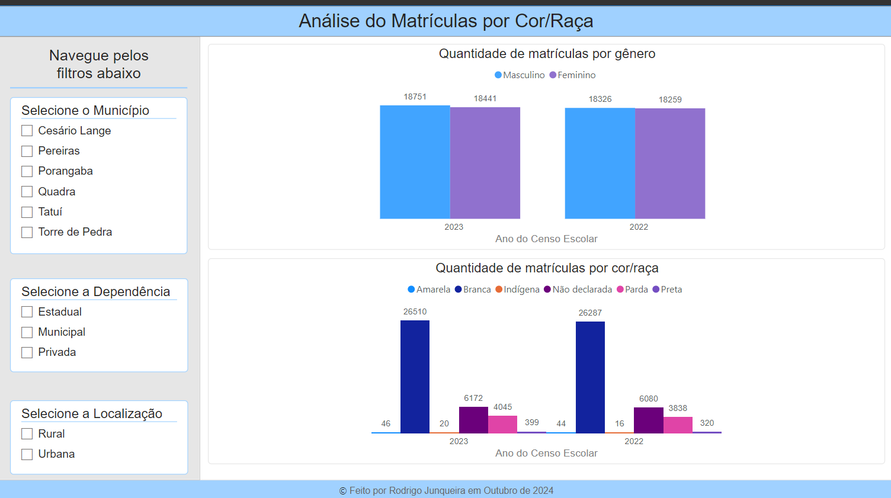

# Análise exploratória de dados do censo escolar da educação na região geográfica imediata de Tatuí

## Introdução:
Este estudo foi realizado como ferramenta auxiliar no trabalho de conclusão de curso (TCC) para obtenção do título de "MBA em Data Science and Analytics" pela USP.

Toda fonte de dados foi obtida gratuitamente através dos microdados publicados pelo "gov.br" em: https://www.gov.br/inep/pt-br/acesso-a-informacao/dados-abertos/microdados/censo-escolar

O repositório consiste em: 
- Análise exploratória em linguagem Python;
- Dashboard elaborado na ferramenta Power BI para facilitar a visualização de alguns dados do censo escolar.

## Desenvolvimento:
Para guia o desenvolvimento, busquei responder algumas perguntas, como:
- Sobre a análise geral dos dados
    - Qual é quantidade de estudantes da região imediata de Tatuí?
    - Qual é a quantidade de docentes da região?
    - Quais são as quantidades de estudantes organizados pelas etapas da educação básica?
    - Qual é a localização das escolas?
    - Qual é a diferença entre de matrículas entre os anos de 2022 e 2023?

- Sobre a distribuição de recursos e infraestrutura:
    - Como as escolas estão distribuídas por tamanho (número de alunos e professores) e localização (zona rural ou urbana)?
    - Como se distribuem as infraestruturas nas escolas?
    - Como se distribuem os recursos tecnológicos nas escolas?
    - As escolas possuem outros profissionais trabalhando além de Professores?
    - As escolas possuem fornecimentos de recursos básicos, como água potável, banheiros e energia elétrica?

- Sobre a desigualdade por gênero e raça:
    - Há uma diferença significativa na taxa de matrícula entre os gêneros feminino e masculino?
    - Qual é a distribuição racial dos estudantes?

## Dashboard:
- Guia "Visão Geral":

- Guia "Infraestrutura":

- Guia "Recursos de Informática":

- Guia "Análise de Gênero e cor/raça":

## Contato:
E-mail: eurodrigojunqueira@gmail.como

LinkedIn: https://www.linkedin.com/in/rodrigo-junqueira/

Portfólio: https://rodrigojunqueiradev.github.io/
